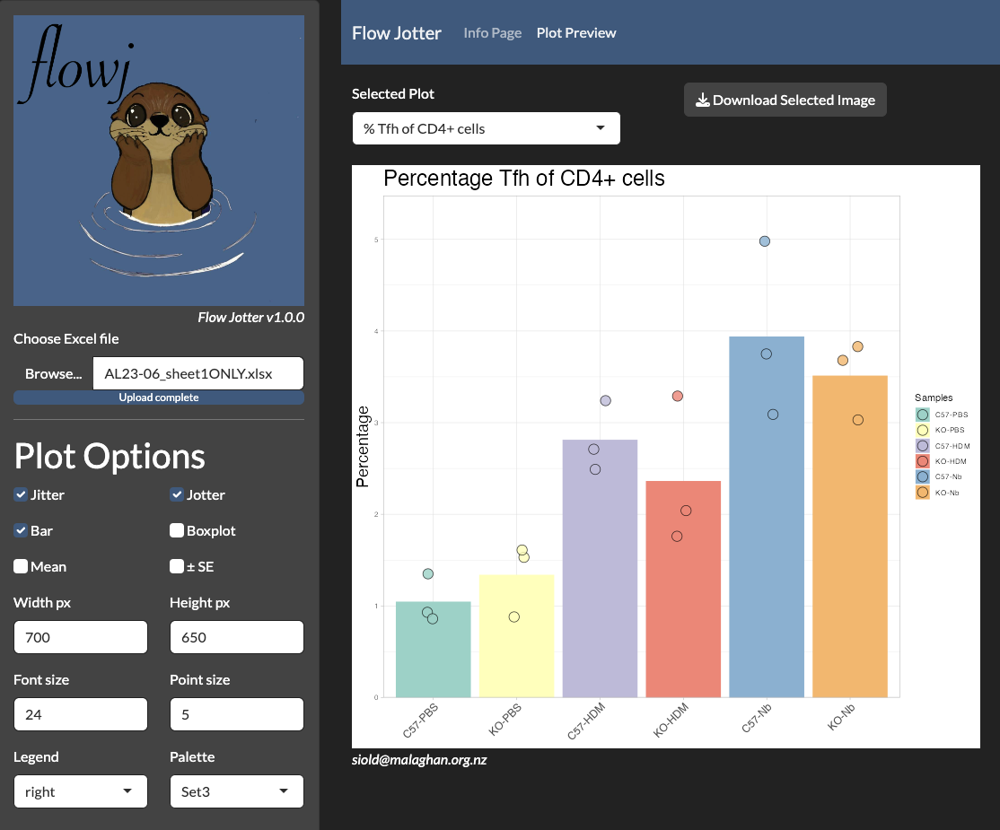

<!-- README.md is generated from README.Rmd. Please edit that file -->

# flowjotter

<!-- badges: start -->
<!-- badges: end -->

Flowjotter is a time-saving tool for researchers working with High
Dimensional Flow Cytometry data.

- Useful for quick, automated plotting of Cytometry data from the FlowJo
  data export table exported into excel files.

- Extremely fast conversion to Prism file format for users who would
  prefer to make their graphs or statatistics in Prism (.prism files
  require Prism 10). If you have an earlier version of Prism, you can
  manually correct the file format to .pzfx

<figure>

<figcaption aria-hidden="true">The flowjotter UI</figcaption>
</figure>

# Installation

You can install the development version of flowjotter from
[GitHub](https://github.com/) with:

    if(!require(devtools)) {
      install.packages("devtools")
    } 
    devtools::install_github("SameOldSamOld/flowjotter")

    .rs.restartR()

# Running flowjotter

This is a basic example which shows you how to use the shiny app:

    # Load Package
    library(flowjotter)

    # Run shiny app
    flowjotter()

# Usage

### Choosing Graph types

Graph type is decided by the first character of the column title:

- % = Percentage Graph

- N = Number Graph

- M = MFI Plot

Red columns in the ‘Info Page’ table viewer highlight columns not
starting with “%”, “N”, or “M”.

Column names must be unique.

### Choosing Groups

The left-most column (‘Samples’) dictates groups for samples.

Everything before the first underscore (\_) becomes grouped.

There is no limit on the number of groups

# FAQ

### Is there an example of how to setup an Excel file?

A typical Excel counts layout can be read in /data/ with base::load(),
or downloaded in the flowjotter app Info Page.

### Can my excel file contain multiple sheets?

Yes, but each sheet must have a consistent and viable column name, group
name and data.

No:

- If you are changing the groups that are to be plotted in each sheet,
  it will not work.

- Groups must stay the same throughout the excel sheet e.g. HDM vs Nb vs
  Ca

- To perform multiple comparisons e.g. (HDM vs Nb) & (HDM vs Ca) & (Nb
  vs Ca), you will need to create multiple excel files

  - If multiple sheets are encountered, you may reach a warning if not
    correctly formatted.

### Why are my images squished?

You may need to increase the ‘Height px’ or ‘Width px’ of your image

### Why are my groups getting oversplitting into multiple groups?

Carefully read the figure legend, there is most likely a tiny typo in
your Samples column.
